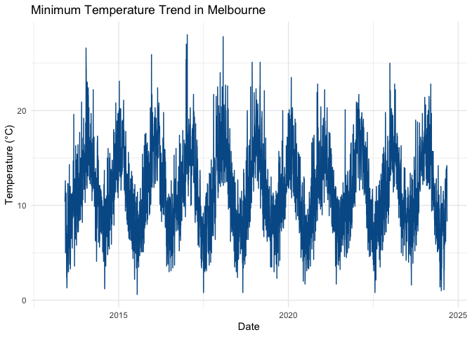

<!-- README.md is generated from README.Rmd. Please edit that file -->

# melbWeather

<!-- badges: start -->
<!-- badges: end -->

The melbWeather package provides tools to analyze and visualize
Melbourne’s weather data, including minimum and maximum temperature
trends over time. It is designed for students and analysts looking to
explore temperature patterns in a user-friendly way using R and Shiny.

## Installation

You can install the development version of melbWeather from GitHub with:
[GitHub](https://github.com/ETC5523-2024/assignment-4-packages-and-shiny-apps-tdew0002)
with:

``` r
# Install the 'remotes' package if you haven't already
install.packages("remotes")
remotes::install_github("ETC5523-2024/assignment-4-packages-and-shiny-apps-tdew0002")
```

## Getting Started

Load the package with:

``` r
library(melbWeather)
```

### Cleaning Raw Weather Data

The clean_weather_data() function is created and used to clean raw
weather data files before performing analysis. Here’s an example of how
to use it:

``` r
# Assuming you have raw CSV files for minimum and maximum temperatures
min_temp_path <- "data-raw/melbourne_weather_min.csv"
max_temp_path <- "data-raw/melbourne_weather_max.csv"

# Clean the data using the clean_weather_data function
weather_data <- clean_weather_data(min_temp_path, max_temp_path)

# View the first few rows of the cleaned data
head(weather_data)
```

The clean_weather_data() function combines the data from both files,
standardises column names, and formats dates for further analysis.

### Weather data

User does not need to use the clean_weather_data() function, instead the
dataset created by clean_weather_data() function in this package can be
directly access by using weather_data, which contains daily weather
records for Melbourne, including minimum and maximum temperatures.

``` r
# Load Melbourne weather data
data("weather_data")

# Display the first few rows of the data
head(weather_data)
#>   year month day minimum_temperature_degree_c maximum_temperature_degree_c
#> 1 2013    01  01                           NA                           NA
#> 2 2013    01  02                           NA                           NA
#> 3 2013    01  03                           NA                           NA
#> 4 2013    01  04                           NA                           NA
#> 5 2013    01  05                           NA                           NA
#> 6 2013    01  06                           NA                           NA
```

## Example Analysis

Here is an example of summarising a basic dataset:

``` r
summary(weather_data$minimum_temperature_degree_c)
#>    Min. 1st Qu.  Median    Mean 3rd Qu.    Max.    NA's 
#>    0.60    8.60   11.30   11.57   14.50   28.00     152
```

You can also embed plots, for example:

``` r
library(ggplot2)
ggplot(weather_data, aes(x = as.Date(paste(year, month, day, sep = "-")), y = minimum_temperature_degree_c)) +
  geom_line(color = "#005b96") +
  labs(
    title = "Minimum Temperature Trend in Melbourne",
    x = "Date",
    y = "Temperature (°C)"
  ) +
  theme_minimal()
```



## Launch the Shiny App

The `melbWeather` package includes an interactive Shiny app for
exploring weather data. You can access the app directly online:

[Launch the Interactive Shiny
App](https://tycia.shinyapps.io/melbWeatherApp/)

To run the app locally, use the following command:

``` r
# Launch the Shiny app
startApp()
```

## Vignettes

For a detailed tutorial and examples on how to use melbWeather, check
out the vignette:

``` r
# View the vignette after installing the package
vignette("melbWeather-introduction")
```

The vignette provides step-by-step instructions on how to clean weather
data, use the interactive Shiny app, and perform analyses with the
melbWeather package.

Or read it online at the
[pkgdown](https://etc5523-2024.github.io/assignment-4-packages-and-shiny-apps-tdew0002/)
site.

## License

This package is licensed under the MIT License. See the LICENSE file for
more information.

## Aknowledgement

Data for this package is sourced from the [Australian Bureau of
Meteorology](http://www.bom.gov.au/).

### Key Sections of the `README.Rmd`

1.  **Package Introduction**: Provides a brief overview of what the
    `melbWeather` package does.
2.  **Installation**: Includes instructions for installing the package
    using `remotes`.
3.  **Getting Started**: Shows how to load the package and access the
    main dataset.
4.  **Example Analysis**: Demonstrates a simple plotting example using
    `ggplot2` and the `weather_data` dataset.
5.  **Shiny App**: Explains how to launch the Shiny app locally and
    provides a link to the online version hosted on `shinyapps.io`.
6.  **Documentation and Vignettes**: Directs users to the `pkgdown` site
    for full documentation and tutorials.
7.  **License and Acknowledgements**: Mentions the license and credits
    the data source.
